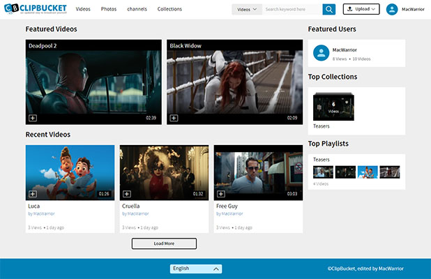
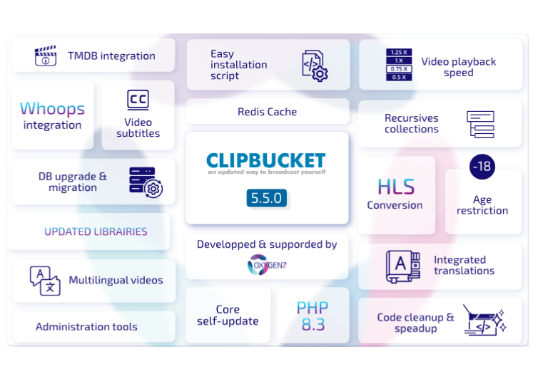

# ClipBucket V5 - An updated way to broadcast yourself
<a href="https://github.com/MacWarrior/clipbucket-v5">ClipBucket V5</a> is a __free updated and upgraded__ version of <a href="https://github.com/arslancb/clipbucket">ClipBucket</a>.

ClipBucket is an Open Source and freely downloadable PHP script that will let you start your own Video Sharing website (YouTube Clone) in a matter of minutes. ClipBucket is the fastest growing video script with the most advanced video sharing and social features.

With ClipBucket, you will have almost all social media features in your hand. You can let your users create groups, playlists, collections and much more. They can send friend requests and private messages to each other as well.
You can start a fully dedicated video sharing website or photo sharing websites and also both at the same time as well.
  

  

# Update 5.5.0
After more than 370 revisions, we're proud to officialy announce the release of ClipBucketV5 - 5.5.0, the biggest update of ClipBucket to this day, implementing tons of new features and preparing it's future.

  

# History
ClipBucket <a href="https://github.com/arslancb/clipbucket">original repository</a> has been slowly dying since the release 4.1 (May 2018) and has been archived on December 2022. 
<a href="https://github.com/MacWarrior/clipbucket-v5">ClipBucket V5</a> was created on 2016 by <a href="https://github.com/MacWarrior">MacWarrior</a> and is part of <a href="https://clipbucket.oxygenz.fr/en/" target="_blank">Oxygenz</a>'s projects since 2023

# Why <a href="https://github.com/MacWarrior/clipbucket-v5">ClipBucket V5</a>
- PHP 7.0 - 8.3+ compatibility
- SQL strict mode compatibility
- MySQL 8+ compatibility
- UHD video resolutions support
- Updated libraries <i>(VideoJS, Smarty, amCharts, ...)</i>
- Chromecast support
- Subtitles support
- Recursive collections
- HLS conversion
- Easy installation scripts
- New configuration options
- Integrated DB update system
- Security, performance, stability and codestyle improvements
  And even more !

# Installation
### Beginners
Greetings young adventurer ! Don't worry, we've thought about you and created some easy installation scripts ! 
All you need is here : <a href="https://github.com/MacWarrior/clipbucket-v5/tree/master/utils">Installation scripts</a> 
<i>It should also be noted that these scripts are meant for testing and development purposes only</i>
### Advanced users
<i>“Your path you must decide.”</i> 
Required : MySQL 5.6+ / MariaDB 10.3+ ; PHP-FPM 7.0+ (+ modules : mysqli, curl, xml, mbstring, gd, openssl, fileinfo ; + functions exec, shell_exec) ; FFmpeg 3+ ; mediainfo ; sendmail 
Recommended : MariaDB 10.3+ ; PHP 8.2+ ; FFmpeg 4.3+
Optionnal : Git 
<i>Only stable versions have been tested, mainly on Debian</i>

# DB auto-update system
On version 5.5.0 (WIP), Revision 169, a new DB update system has been implemented, since then, you can easily update your DB from any version since 4.2 RC1 to any new version/revision. 
Update your sources, log in and follow instructions displayed.

# Updating from ClipBucket 4.2
Follow our [quick steps tutorial](https://github.com/MacWarrior/clipbucket-v5/wiki/Upgrade-from-Clipbucket-4.2)

# Issues
Still reading ? Good ! 
Now your <a href="https://github.com/MacWarrior/clipbucket-v5">ClipBucket V5</a> is installed <i>(or maybe not yet)</i> 
and you request some help ? Or found a bug ? Or have a brilliant idea ? 
Take a step back, breath slowly, and create an <a href="https://github.com/MacWarrior/clipbucket-v5/issues">issue</a> ! 
Be the more precise you can, add screenshots, give examples... I'm sure we will find a solution !

# More
|  |
|---------------------------------------------------------------------------------------------------------| 
| You speak french or you're simply not  affraid by my english ? Welcome !                            |