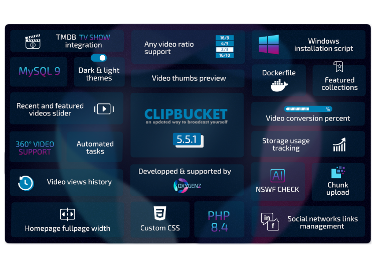

<p align="center">
  <br/>
</p>

<p align="center">
  <a href="https://github.com/MacWarrior/clipbucket-v5">
    
  </a>
  <a href="https://github.com/MacWarrior/clipbucket-v5/releases">
    
  </a>
  <a href="https://hub.docker.com/r/oxygenz/clipbucket-v5">
    
  </a>
</p>


<a href="https://github.com/MacWarrior/clipbucket-v5">ClipBucket V5</a> is a __free updated and upgraded__ version of <a href="https://github.com/arslancb/clipbucket">ClipBucket</a>.

ClipBucket is an open source, freely downloadable PHP script that enables you to launch your own video sharing platform (a YouTube/Netflix clone) within minutes.
<br/>With ClipBucket, users can create playlists, collections, send friend requests, exchange private messages, and much more. You can host a dedicated video or photo sharing site — or even both simultaneously.

Check out our <a href="https://demo.clipbucket.oxygenz.fr/" target="_blank">live demo</a> !

<p align="center">
  
</p>

<details>
  <summary>Check out our light theme</summary>
  <p align="center">
    
  </p>
</details>

# 🔄 Latest release - 5.5.1
After more than 340 revisions, over a year of development and countless improvements, we're proud to officially release ClipBucketV5 - 5.5.1, our most feature-packed and polished update yet — pushing the platform to a whole new level and laying the groundwork for continuous delivery.
<p align="center">
    <a href="https://github.com/MacWarrior/clipbucket-v5/releases/tag/5.5.1">
      
    </a>
</p>
<details>
  <summary>Release 5.5.0</summary>
  After more than 370 revisions, we're proud to officially announce the release of ClipBucketV5 - 5.5.0, the biggest update of ClipBucket to this day, implementing tons of new features and preparing it's future.
    <p align="center">
        <a href="https://github.com/MacWarrior/clipbucket-v5/releases/tag/5.5.0">
          
        </a>
    </p>
</details>

# 🌟 Why <a href="https://github.com/MacWarrior/clipbucket-v5">ClipBucket V5</a>
| PHP 7.0 - 8.4+ compatibility  | MySQL 9+ & strict mode compatibility                              |
|-------------------------------|-------------------------------------------------------------------|
| UHD video resolutions support | TMDB integration                                                  |
| Dark & Light theme            | Age restriction                                                   |
| Chromecast support            | Recursive collections                                             |
| Subtitles support             | HLS conversion                                                    |
| Visual comments editor        | New configuration & personalisation options                       |
| Easy installation scripts     | Updated libraries <i>(VideoJS, Smarty, amCharts, ...)</i>         |
| Integrated DB update system   | Integrated translations <i>(ENG, FRA, DEU, POR, ESP)</i>          |
| AI NSFW check                 | <b>Security, performance, stability and codestyle improvements<b> |

And even more !

# ⌛ History
ClipBucket <a href="https://github.com/arslancb/clipbucket">original repository</a> has been slowly dying since the release 4.1 (May 2018) and has been archived on December 2022.<br/>
<a href="https://github.com/MacWarrior/clipbucket-v5">ClipBucket V5</a> was created on 2016 by <a href="https://github.com/MacWarrior">MacWarrior</a> and is part of <a href="https://clipbucket.oxygenz.fr/en/" target="_blank">Oxygenz</a>'s projects since 2023

## 🌐 Star History
<a href="https://www.star-history.com/#MacWarrior/clipbucket-v5&Date">
 <picture>
   <source media="(prefers-color-scheme: dark)" srcset="https://api.star-history.com/svg?repos=MacWarrior/clipbucket-v5&type=Date&theme=dark"/>
   <source media="(prefers-color-scheme: light)" srcset="https://api.star-history.com/svg?repos=MacWarrior/clipbucket-v5&type=Date"/>
   
 </picture>
</a>

# 📦 Installation
## With Docker
Installing <a href="https://github.com/MacWarrior/clipbucket-v5">ClipBucket V5</a> using Docker provides a streamlined and isolated environment for running the application.

### Run the ClipBucketV5 Container from DockerHub :
   ```bash
   docker run \
   --restart unless-stopped \
   --pull=always \
   -e DOMAIN_NAME=clipbucket.local \
   -e MYSQL_PASSWORD=clipbucket_password \
   -e UID=1000 \
   -e GID=1000 \
   -v clipbucket_db:/var/lib/mysql \
   -v clipbucket_files:/srv/http/clipbucket \
   -p 80:80 \
   --name clipbucket \
   -d oxygenz/clipbucket-v5:latest
   ```
<details>
  <summary>Docker command options explanation</summary>
  <code>docker run</code> options :
  <ul>
    <li>
      <code>--restart unless-stopped</code> : Automatically restarts the container unless explicitly stopped.
    </li>
    <li>
      <code>--pull=always</code> : Ensures the image is always pulled before starting, even if it exists locally.
    </li>
    <li>
      <code>-e DOMAIN_NAME=...</code> : Sets the domain name for your <a href="https://github.com/MacWarrior/clipbucket-v5">ClipBucket V5</a> instance.
    </li>
    <li>
      <code>-e MYSQL_PASSWORD=...</code> : Specifies the root password for MySQL.
    </li>
    <li>
      <code>-e UID=1000</code> : Sets the user ID (UID) for the application running inside the container. 1000 is the typical UID for the first user on Linux systems. If you want a different user, adjust the UID.
    </li>
    <li>
      <code>-e GID=1000</code> : Sets the group ID (GID) for the application running inside the container. Like UID, this is often 1000 by default, but it can be adjusted if you want a different group.
    </li>
    <li>
      <code>-v clipbucket_db:/var/lib/mysql</code> : Maps a persistent volume for the database.
    </li>
    <li>
      <code>-v clipbucket_files:/srv/http/clipbucket</code> : Maps a persistent volume for ClipBucket files.
    </li>
    <li>
      <code>-p 80:80</code> : Maps port 80 on the host to port 80 on the container, making the application accessible via the host machine.
    </li>
    <li>
      <code>--name clipbucket</code> : Names the container for easier management.
    </li>
    <li>
      <code>-d</code> : Runs the container in detached mode.
    </li>
  </ul>
</details>

<details>
  <summary>UID and GID Explanation for Bind Mounts in Docker</summary>
  UID and GID are only necessary when using bind mounts in Docker. A bind mount links a directory on your host machine to a directory in the container, like this:<br/>
  <pre>-v /path/to/host/folder:/srv/http/clipbucket</pre>
  With bind mounts, Docker does not modify file permissions. 
  If the UID and GID of the container's user do not match those of the host system, there can be permission issues. 
  For example, files created by the container might not be accessible from the host and vice versa.
</details>
<details>
  <summary>Why UID and GID matter</summary>
  UID (User ID) and GID (Group ID) are numeric identifiers for users and groups on the system.<br/>
  If the container's UID and GID do not match those of the host user, permission issues arise.
</details>
<details>
  <summary>UID and GID solution</summary>
  Set the UID and GID in the docker run command to match the host user:
  <pre>-e UID=1000 \
-e GID=1000</pre>
  If you use Docker volumes (not bind mounts), UID and GID are not necessary since Docker manages the permissions internally.
  To find the UID and GID of a user on your host system (Debian), you can run the following commands:
  <pre>id username</pre>
Replace username with the name of the user. For example, for the user john, use id john.
</details>

## On dedicated server
<details>
  <summary>Beginners - Easy installation scripts</summary>
  New to server installation? Don’t worry — we’ve got you covered !<br/>
  All you need is here : <a href="https://github.com/MacWarrior/clipbucket-v5/tree/master/utils">Installation scripts</a><br/>
  <i>It should also be noted that these scripts are meant for testing and development purposes only</i>
</details>
<details>
  <summary>Advanced users</summary>
  <i>“Your path you must decide.”</i><br/>
  Required : MySQL 5.6+ / MariaDB 10.3+ ; PHP-FPM 7.0+ (+ modules : mysqli, curl, xml, mbstring, gd, openssl, fileinfo ; + functions exec, shell_exec) ; FFmpeg 3+ ; mediainfo ; sendmail<br/>
  Recommended : MariaDB 10.3+ ; PHP 8.3+ ; FFmpeg 4.3+<br/>
  Optionnal : Git, PHP module FFI<br/>
  <i>Only stable versions have been tested, mainly on Debian</i>
</details>

# ♻ Continuous deployment
<a href="https://github.com/MacWarrior/clipbucket-v5">ClipBucket V5</a> works on the principle of continuous deployment, that is to say that the most stable version with the most features and fixes is the <a href="https://github.com/MacWarrior/clipbucket-v5/commits/master/">master version</a>.
<br/>Use GIT to install your copy of <a href="https://github.com/MacWarrior/clipbucket-v5">ClipBucket V5</a> and easily keep it up to date thanks to our integrated systems.

# ↻ How to update
When installed with git, <a href="https://github.com/MacWarrior/clipbucket-v5">ClipBucket V5</a> can self-update.<br/>
Simply log in and follow instruction from Admin Area > Dashboard.
<p align="center">
  
</p>

# ↑ Updating from ClipBucket 4.2
Follow our [quick steps tutorial](https://github.com/MacWarrior/clipbucket-v5/wiki/Upgrade-from-Clipbucket-4.2)

# 🛠️ Issues
Need help or found a bug ? Have an idea ?<br/>
Create an <a href="https://github.com/MacWarrior/clipbucket-v5/issues">issue</a> and describe it clearly. Add screenshots, steps to reproduce, logs, etc.

# 🔗 Join the Community
<a href="https://discord.gg/HDm5CjM"></a>

# ✨ How to help us
- Report <a href="https://github.com/MacWarrior/clipbucket-v5/issues" target="_blank">issues</a> to help us improve <a href="https://github.com/MacWarrior/clipbucket-v5">ClipBucket V5</a>
- ⭐ Star us on <a href="https://github.com/MacWarrior/clipbucket-v5" target="_blank">GitHub</a>
- ⭐ Star us on <a href="https://hub.docker.com/r/oxygenz/clipbucket-v5" target="_blank">DockerHub</a>
- 👤 Follow us on <a href="https://www.linkedin.com/company/oxygenz/" target="_blank">Linkedin</a>
- 🔥 Upvote us on <a href="https://www.producthunt.com/posts/clipbucketv5" target="_blank">Product Hunt</a>
